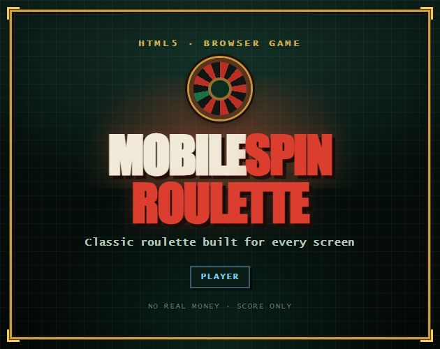

# MobileSpinRoulette



**Open-source roulette built for mobile and desktop.**

[Play on itch.io](https://bitcroupier.itch.io/mobile-roulette)

MobileSpinRoulette is a browser-based roulette game focused on a fast, touch-friendly table experience. It is designed for small mobile displays, tablets and desktop browsers, with no backend, account or real-money transactions.

## Features

- European and American roulette tables.
- Inside and outside bets, racetrack calls, Rebet, Double and Undo.
- Strategy creator with up to 24 saved betting layouts.
- Session statistics and score trend chart.
- Configurable music, sound effects, animation and table settings.
- Responsive layouts for desktop, tablets and small phones, including iPhone SE-sized screens.
- Installable Progressive Web App with offline-ready production assets.
- English, Italian, Spanish, Brazilian Portuguese, French, German, Korean, Japanese and Chinese interfaces.
- Local autosave plus JSON export and import from Settings.

The in-app Privacy screen uses the current language and never opens a URL. Play Console must use the single hosted index [`https://mobilespinroulette.pages.dev/privacy.html`](https://mobilespinroulette.pages.dev/privacy.html). The same pages also live under [`public/privacy/`](./public/privacy/) for the itch zip and under [`hosting/privacy/`](./hosting/privacy/) for Cloudflare Pages. The game uses virtual points only and provides no purchases, prizes, cash-out or accounts.

The game uses points only. A new profile starts with **2000000 score**, and starting a new game restores that amount when the score is zero or below.

## How to play

Choose a chip, tap the felt to place bets and press **Spin**. The table supports straight, split, street, corner, six-line and outside bets, plus the European racetrack calls where applicable. Saved strategies can place a complete layout in one action.

## Spin engine

The result is independent of score and presentation settings:

1. `crypto.getRandomValues` supplies cryptographically secure initial conditions.
2. Ball and wheel movement are integrated by the spin simulation until the ball drops.
3. The result maps to the physical European (37-pocket) or American (38-pocket) wheel order.
4. The canvas animation presents the result already selected by the engine.

Relevant files:

| File | Purpose |
| --- | --- |
| `src/spin/spinEngine.ts` | Spin simulation and result selection |
| `src/spin/rng.ts` | Cryptographically secure random source |
| `config/wheel-spin.json` | Simulation parameters and wheel order |
| `src/wheel/canvasWheel.ts` | Roulette wheel rendering and animation |

## Run locally

Requirements: a current Node.js release and npm.

```powershell
git clone https://github.com/orfeomorello/OpenSource-Mobile-Spin-Roulette.git
cd OpenSource-Mobile-Spin-Roulette
npm.cmd install
npm.cmd run dev
```

Open `http://localhost:5173/`. On macOS or Linux, use `npm` in place of `npm.cmd`.

## Tests and production build

```powershell
npm.cmd test
npm.cmd run build
npm.cmd run preview
```

The production build is written to `dist/`. It regenerates the launcher icons and injects the complete local application shell into a versioned service-worker cache. Optional music remains on-demand and is intentionally not duplicated in offline storage.

PWA launcher assets can also be regenerated directly:

```powershell
npm.cmd run generate:icons
```

The manifest provides separate `any` and `maskable` PNG icons at 192 and 512 pixels, plus a 180-pixel Apple touch icon. Relative `id`, `scope` and `start_url` values preserve installability when the app is hosted in a subdirectory.

To create the itch.io upload package after building:

```powershell
node scripts/zip-itch.mjs
```

This creates `mobilespinroulette-itch.zip`. The recommended itch.io embed size is **1024 × 600**, with fullscreen and mobile-friendly options enabled.

The public product site lives in [`hosting/`](./hosting/). It is the Cloudflare Pages origin `https://mobilespinroulette.pages.dev/` (landing, GitHub, itch link, Play privacy pages). It does not serve the game. Refresh it with `npm.cmd run generate:privacy` and `npm.cmd run generate:hosting`, then deploy that folder as the Pages root.

## Project structure

| Path | Purpose |
| --- | --- |
| `src/core/` | Game rules, payouts and player state |
| `src/spin/` | Spin simulation and secure random generation |
| `src/player/` | Touch betting and felt snapping |
| `src/persist/` | Profile, session, settings and strategy persistence |
| `src/i18n/` | Translation catalogs and locale metadata |
| `config/` | Game balance, controls, bets and wheel configuration |
| `public/` | PWA files, icon and optional audio assets |
| `hosting/` | Cloudflare Pages vetrina + store privacy (not the game) |
| `playstore/` | Play Console listing kit |
| `android/` | Capacitor Android project. Application ID `io.mobilespinroulette.app` |
| `capacitor.config.ts` | Capacitor config: packages `dist/`, no remote URL |
| `LICENSE` | GNU GPLv3 text for the software |
| `NOTICE` | Copyright notice and third-party license map |

The application is built with TypeScript and Vite. It has no backend and does not include analytics. The Play package embeds that same `dist/` folder so the APK does not depend on Cloudflare Pages.

## Android APK / Play bundle

The game files live inside the APK. Recreate the sideload package after any game change:

```powershell
npm.cmd run apk
```

This runs the production web build, copies it into `android/`, and writes `android-dist/MobileSpinRoulette-debug.apk`.

Requirements: Android SDK platform 36 (Android Studio installs the SDK under `%LOCALAPPDATA%\Android\Sdk`) and **JDK 21**. The JBR 25 bundled with current Android Studio is too new for this Gradle wrapper. `npm run apk` prefers `C:\Program Files\Microsoft\jdk-21.0.12.8-hotspot` when present.

Play Console wants a signed Android App Bundle, not the debug APK:

```powershell
$env:MOBILESPINROULETTE_KEYSTORE = "C:\path\to\upload-keystore.jks"
$env:MOBILESPINROULETTE_KEY_ALIAS = "upload"
$env:MOBILESPINROULETTE_STORE_PASSWORD = "..."
$env:MOBILESPINROULETTE_KEY_PASSWORD = "..."
npm.cmd run aab
```

That writes `android-dist/MobileSpinRoulette.aab`. Do not commit the keystore. Do not change the application ID after the first Play upload.

```powershell
npm.cmd run android:open
```

opens the native project in Android Studio.

## Local data and migration

Progress is saved automatically in browser `localStorage`:

| Key | Content |
| --- | --- |
| `mobilespinroulette.profile.v1` | Persistent score data |
| `mobilespinroulette.settings.v1` | Table, animation, audio and interface settings |
| `mobilespinroulette.session.v3` | Current table session data |
| `mobilespinroulette.betTemplates.v1` | Saved betting strategies |
| `mobilespinroulette.locale.v1` | Selected interface language |

Legacy project keys are migrated automatically when found. Settings also provide a complete JSON backup and restore workflow; exported files use the `mobilespinroulette-export-YYYY-MM-DD.json` naming scheme.

## Audio

`npm run dev` and `npm run build` automatically execute `npm run prepare:audio`. The script checks the tracks declared in `public/audio-manifest.json`, reuses valid local files and can retrieve supported assets. Missing optional music produces a warning but does not prevent the game from running.

The selectable Player playlist contains the six tracks whose filenames begin with `andriih-`. To provide those files from an authorized asset host, set:

```powershell
$env:MOBILESPINROULETTE_AUDIO_BASE_URL = "https://your-authorized-host.example/mobilespinroulette-audio"
npm.cmd run prepare:audio
```

The host must expose each file using the name listed in `public/audio-manifest.json`. Source links, attribution and licensing notes are documented in [`public/audio/CREDITS.md`](./public/audio/CREDITS.md). The playlist files keep the Pixabay Content License; they are not relicensed under the GPL.

## License

The MobileSpinRoulette **software** is licensed under the [GNU General Public License v3.0 or later](./LICENSE) (`GPL-3.0-or-later`). You may redistribute and modify the program under those terms.

Bundled fonts and music keep their **original** licenses. They are not placed under the GPL. The map is in [`NOTICE`](./NOTICE).

| Material | License |
| --- | --- |
| Software (`src/`, `config/`, `scripts/`, built JS and CSS) | GPL-3.0-or-later |
| Synthesized sound effects in `src/audio.ts` | GPL-3.0-or-later |
| Inter font (`src/assets/fonts/`) | [SIL Open Font License 1.1](./src/assets/fonts/OFL.txt) |
| Menu loop `mus_menu_loop.mp3` | [CC0 1.0](https://creativecommons.org/publicdomain/zero/1.0/) |
| Player playlist `andriih-*.mp3` | [Pixabay Content License](https://pixabay.com/service/license-summary/) |

The Pixabay tracks may be used commercially as part of this game. Do not sell or redistribute them as standalone audio files.

## Disclaimer

MobileSpinRoulette is intended for entertainment and educational purposes. It uses virtual points only and does not offer real-money gambling, purchases or prizes.
